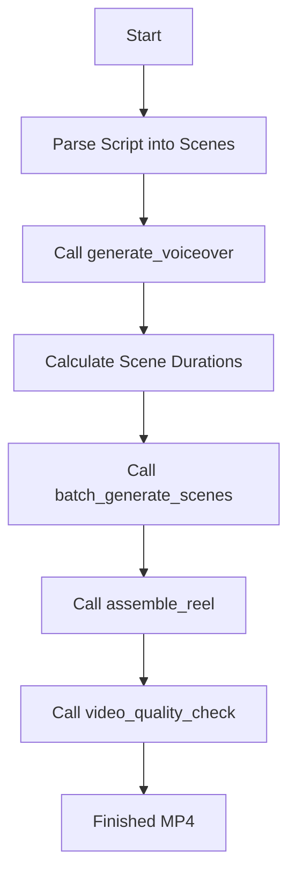

# Agentic Workflow Patterns for video-mcp

This guide explains how AI agents should interact with `video-mcp` tools to execute production workflows.

---

## 1. Script-to-Reel Pipeline (Standard Workflow)
When requested to "make a video reel from this script", follow this sequence:

*Tip: Use `create_reel_from_brief` to execute all of these steps in a single tool call.*

---

## 2. Character Consistency Workflow
If the user requests consistent characters across scenes (e.g., Bob Campana):
1. **Lock Character**: Call `create_character_profile` with character photos and description.
2. **Generate Scenes**: Call `generate_scene_with_character` for each scene. This automatically loads the character face descriptor and feeds it to the video generator.
3. **Assemble**: Stitch the clips together using `assemble_reel`.

---

## 3. Fallback Strategies
Generative AI API calls can fail due to limits or timeouts. Always implement recovery logic:
1. **Model Fallback**: If Kling `quality` fails, retry using model `fast` or `auto`.
2. **Provider Fallback**: If Kling returns `QUOTA_EXCEEDED`, fallback to `hailuo` or `veo`.
3. **Asset Fallback**: If clip generation fails entirely, generate a blank placeholder clip via FFmpeg (`make_placeholder_clip`) so the compilation doesn't crash.

---

## 4. Token-Efficient Usage
1. First, search for tools by keyword using `search_tools("query")`.
2. Use specific parameters. Avoid fetching complete video binaries over the MCP interface; work with local file paths.
3. Check background status asynchronously using `check_generation_job` instead of block-waiting inside single threads.
