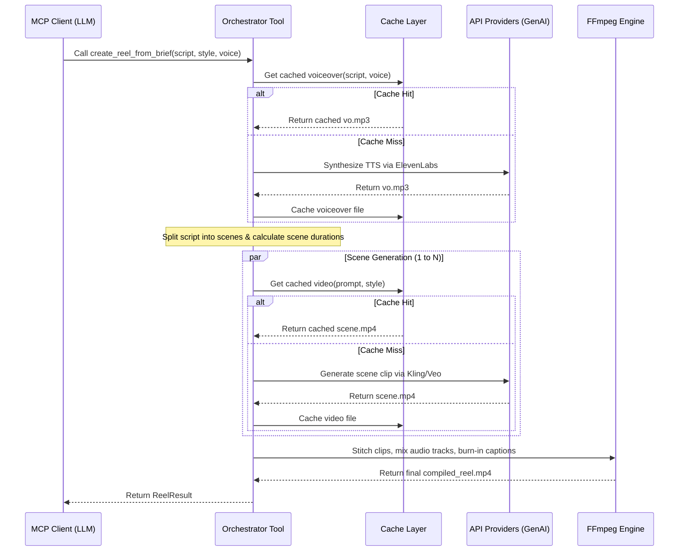

# System Architecture

This guide details the technical layers, data models, and workflow sequences within the Video MCP Server.

---

## 🏗️ Technical Layers

Video MCP is structured into four layers, enforcing separation of concerns:

```
                  ┌──────────────────────────────┐
                  │          FastMCP             │
                  │   Exposes Tools & Resources  │
                  └──────────────┬───────────────┘
                                 │
                                 ▼
                  ┌──────────────────────────────┐
                  │      Guardrail Checks        │
                  │   Validates Paths & Size     │
                  └──────────────┬───────────────┘
                                 │
                                 ▼
                  ┌──────────────────────────────┐
                  │    Caching & Hashing Layer   │
                  │  Checks and saves payloads   │
                  └──────────────┬───────────────┘
                                 │
                   ┌─────────────┴─────────────┐
                   ▼                           ▼
      ┌─────────────────────────┐ ┌─────────────────────────┐
      │     API Providers       │ │     Local Assembly      │
      │  (Kling / ElevenLabs)   │ │  (FFmpeg timeline/srt)  │
      └─────────────────────────┘ └─────────────────────────┘
```

1.  **Transport/Interface Layer (`server.py`, `cli.py`)**: Defines FastMCP server mappings and CLI commands. Handlers invoke lazy-loaded functions.
2.  **Safety Layer (`guardrails.py`)**: Runs pre-execution checks on aspect ratio, size limits, and sanitizes prompts. Enforces strict boundary verification to block path traversal outside `WORK_DIR`.
3.  **Caching Layer (`cache.py`)**: Computes SHA-256 hashes of input payloads and copies files to and from `.mcp_cache/`.
4.  **Adapter/Execution Layer (`providers/`, `tools/`)**: Implements client abstractions for Kling, ElevenLabs, and subprocess configurations for FFmpeg.

---

## 🔄 Execution Sequences

### 1. Script-to-Reel Compilation Workflow
The flagship orchestrator `create_reel_from_brief` coordinates voice synthesis and parallel scene generation:



### 2. Guardrails Boundary Checks
To prevent path traversal, all input/output paths are resolved against `WORK_DIR`:

```python
# Simplified flow inside guardrails.py
def validate_input_path(path_str: str) -> Path:
    work_dir = settings.work_dir.resolve()
    path = Path(path_str).resolve()
    
    # Check traversal boundary
    try:
        path.relative_to(work_dir)
    except ValueError:
        raise PathViolationError("Escape attempt blocked")
    
    if not path.exists():
        raise FileNotFoundError()
    return path
```
