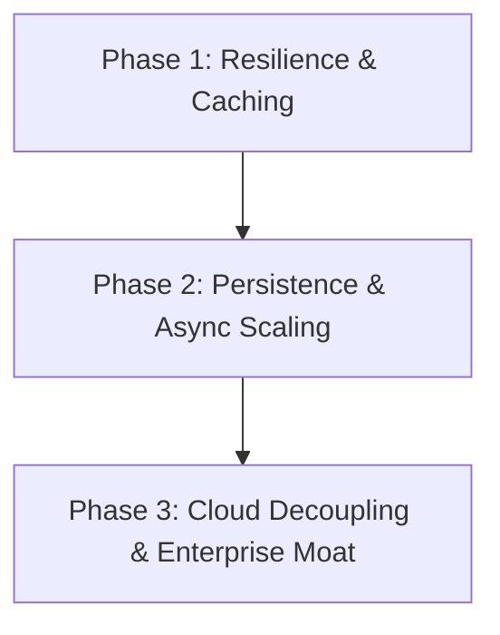

# Video MCP: Production Road to 10/10

This document outlines the strategic engineering roadmap, architectural enhancements, and ecosystem positioning required to scale the **Video MCP Server** into the definitive, category-leading open-source solution for automated video generation.

---

## 🗺️ Ranked Implementation Roadmap

We categorize the necessary modifications into three progressive phases, shifting the codebase from a single-machine orchestrator to a resilient, cloud-decoupled, enterprise-grade media engine.



### Phase 1: Resilience, Caching & Local Checkpoints (Quick Wins)
*   **Asset Content Caching**: Hash input parameters (voice narration, image reference, style) to prevent duplicate generation calls to Kling/ElevenLabs.
*   **Checkpoint & Resume**: Cache progress to disk (`.mcp_cache/`) so crashes at scene $N$ of $M$ skip steps $1 \dots N-1$ on retries.
*   **Pre-flight Media Diagnostics**: Run quick structural checks via local `ffprobe` (such as validating codecs, frame rate, and file integrity) before dispatching requests to external paid APIs.

### Phase 2: SQLite Persistence & Async Task Scaling (High-Impact)
*   **SQLite State Store**: Replace volatile in-memory dictionary-based queue status trackers with a thread-safe local SQLite database (`jobs.db`).
*   **Async Transport Shielding**: Avoid blocking MCP protocol request loops during long video rendering processes (e.g. Kling video exports taking 3+ minutes). Ensure tools immediately yield a job tracking ID and delegate execution to background worker threads.
*   **Fallback API Providers**: Build automatic fallback loops. If Kling returns `QUOTA_EXCEEDED` or times out, fail over to Hailuo or Veo automatically.

### Phase 3: Cloud Decoupling & Enterprise Moat (High-Effort / High-Impact)
*   **Storage Provider Interface**: Decouple the file operations from the host machine disk path by adding support for S3-compatible cloud storages (AWS S3, Cloudflare R2, Google Cloud Storage).
*   **Interactive Web UI Dashboard**: Build a lightweight embedded dashboard (`video-mcp dashboard`) powered by FastAPI/Svelte to manage rendering jobs, inspect generated reels, and configure profiles.
*   **Distributed Task Queues**: Package the server with Celery or RQ workers templates, allowing horizontal scaling of video compilations across multiple nodes.

---

## 🏛️ Proposed Architecture Changes

```
┌────────────────────────────────────────────────────────────────────────┐
│                              MCP CLIENT                                │
│                     (Claude Desktop, Cursor, etc.)                     │
└───────────────────────────────────┬────────────────────────────────────┘
                                    │ MCP Protocol (JSON-RPC)
                                    ▼
┌────────────────────────────────────────────────────────────────────────┐
│                          FASTMCP ROUTER LAYER                          │
│                      (Exposes Tools & Resources)                       │
└───────────────────────────────────┬────────────────────────────────────┘
                                    │
                                    ▼
┌────────────────────────────────────────────────────────────────────────┐
│                           ORCHESTRATION LAYER                          │
│    ┌──────────────────────────────┬──────────────────────────────┐     │
│    │     Job Manager (SQLite)     │     Deterministic Cache      │     │
│    └──────────────┬───────────────┴──────────────┬───────────────┘     │
│                   │                              │                     │
│                   ▼                              ▼                     │
│    ┌──────────────────────────────┬──────────────────────────────┐     │
│    │     Provider Fallbacks       │      Storage Abstraction     │     │
│    │   (Kling / Hailuo / Veo)     │      (Local / S3 / R2)       │     │
│    └──────────────────────────────┴──────────────────────────────┘     │
└───────────────────────────────────┬────────────────────────────────────┘
                                    │
                                    ▼
┌────────────────────────────────────────────────────────────────────────┐
│                          MEDIA COMPILING ENGINE                        │
│                         (FFmpeg Subprocess Pool)                       │
└────────────────────────────────────────────────────────────────────────┘
```

### 1. Storage Abstraction Layer
Define a clean `StorageBackend` protocol to isolate local file writes from cloud stores:

```python
from typing import Protocol
from pathlib import Path

class StorageBackend(Protocol):
    async def upload_file(self, local_path: Path, remote_key: str) -> str: ...
    async def download_file(self, remote_key: str, local_destination: Path) -> Path: ...
    async def get_presigned_url(self, remote_key: str, expires_in: int = 3600) -> str: ...
```

### 2. State & Caching Schemas
A thread-safe SQLite backend stores task tracking metadata:

```sql
CREATE TABLE IF NOT EXISTS jobs (
    id TEXT PRIMARY KEY,
    status TEXT NOT NULL,          -- PENDING, PROCESSING, COMPLETED, FAILED
    provider TEXT NOT NULL,
    payload TEXT NOT NULL,         -- JSON payload
    output_key TEXT,               -- Target S3 or local path key
    error_message TEXT,
    created_at TIMESTAMP DEFAULT CURRENT_TIMESTAMP,
    updated_at TIMESTAMP DEFAULT CURRENT_TIMESTAMP
);

CREATE TABLE IF NOT EXISTS asset_cache (
    content_hash TEXT PRIMARY KEY, -- SHA256 of text/image/parameters
    provider TEXT NOT NULL,
    output_key TEXT NOT NULL,
    created_at TIMESTAMP DEFAULT CURRENT_TIMESTAMP
);
```

---

## 🛡️ Competitive Moats: Features to Own the Domain

To outpace generic wrappers, `video-mcp` should own three unique pillars:
1.  **Semantic Video Search & Storyboarding**: Read local video files, extract structural frames using lightweight local visual encoders, and index keyframes into a simple vector index so the agent can "see" what scenes look like.
2.  **Smart BGM Matching**: Automatically analyze narration rhythm and select matching background music (BGM) matching high-energy segments with audio beats.
3.  **Adaptive Caption Layouts**: Run subtitles font layout collision prevention. Calculate video frame centers and dynamically wrap or lower caption positions to avoid covering human faces or key subject elements.

---

## 📈 Open-Source & Ecosystem Growth Strategy

```mermaid
chronological
    title Project Growth Milestones
    GitHub Release v0.2.0 (Resilience Update) : Launch cache, checkpointing, and SQLite integrations
    MCP Registry Listing & Docs Site : Submit server to registry, launch documentation site
    GitHub Release v0.3.0 (Cloud Update) : Launch AWS S3/R2 cloud storage backends and Docker templates
```

### 1. MCP Registry and Ecosystem Integration
*   Submit the package to the official [Model Context Protocol Registry](https://github.com/modelcontextprotocol/servers).
*   Coordinate with the developer communities at **Anthropic (Claude Developer Relations)**, **Glama**, and **Smithery** to get featured as the flagship generative video server.

### 2. GitHub SEO & Growth Hack Action Plan
*   **Badges**: Feature dynamic badges (Build Status, Coverage, PyPI version, Downloads Counter).
*   **Social Preview Graphic**: Design a custom repository social image illustrating Claude Desktop running the `create_reel_from_brief` tool side-by-side with compiled Pixar-style reels.
*   **Documentation Site**: Host a documentation portal (`video-mcp.dev`) powered by Docusaurus or VitePress with interactive code playgrounds and visual output reels showcase.

---

## 🎯 Success Metrics

| Target Area | Baseline | Target (3 Months) |
| :--- | :---: | :---: |
| **API Costs (Compilation)** | High (No cache fallback) | **Reduced by 35%** (Cache hits) |
| **Orchestrator Failure Rates** | ~15% (Network timeout / quota) | **< 1%** (Fallback providers & checkpoints) |
| **Tool Execution Latency** | Blocking transport loop | **Instant return** (Async ID generation) |
| **GitHub Stars** | 0 | **1,000+** |
| **PyPI Monthly Downloads** | 0 | **5,000+** |
